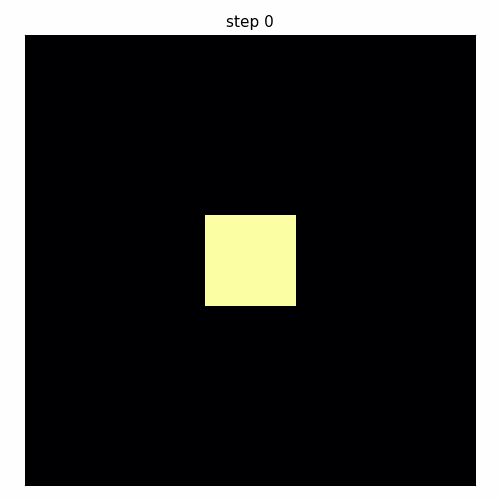
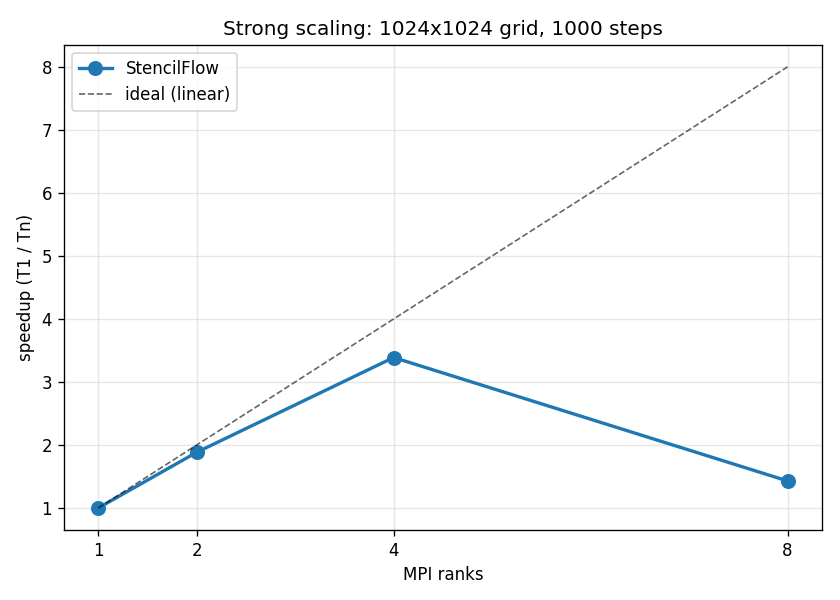
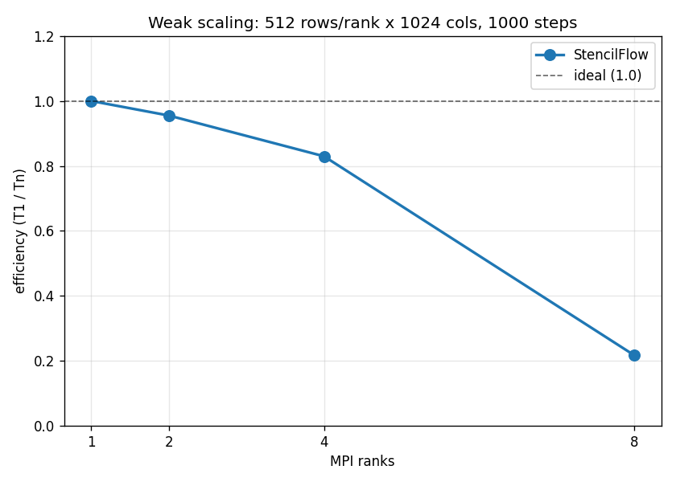

# StencilFlow

A hybrid **MPI + OpenMP** solver for the 2D heat equation in modern C++17.

Built as a focused demonstration of the patterns reservoir simulators
use: stencil computation, 1D domain decomposition, halo exchange,
hybrid parallelism, and honest scaling measurement.



512x512 grid, 30,000 timesteps, four MPI ranks with OpenMP-parallel
stencil inside each. Frames are sampled every 1500 steps; total wall
time ~5.8s on Apple Silicon at ~1.35 billion cell-updates per second.
Diffusion reaches well into the boundary region by the final frame.




## What it solves

The 2D heat equation on a regular Cartesian grid:

```
du/dt = alpha * (d^2 u / dx^2 + d^2 u / dy^2)
```

Time is discretized with explicit forward Euler and space with a
**5-point stencil**:

```
u_new[i, j] = (1 - 4c) * u[i, j]
              + c * (u[i-1, j] + u[i+1, j] + u[i, j-1] + u[i, j+1])
```

where `c = alpha * dt / dx^2` is the dimensionless diffusion number
(stability requires `c <= 0.25` in 2D; the default is 0.2).

Output is a sequence of PGM frames showing heat diffusing from an
initial central hot spot.

## Architecture

```
+-------------------+    halo exchange via MPI_Sendrecv   +-------------------+
|       Rank 0      |  <------------------------------>   |       Rank 1      |
|  rows [0, N/4)    |                                     |  rows [N/4, N/2)  |
|  +halo bottom     |                                     |  +halo top/bot    |
|                   |  ~~~ OpenMP collapse(2) within ~~~  |                   |
+-------------------+        each rank's step()           +-------------------+
```

* **MPI** across ranks: horizontal-strip domain decomposition. Each
  rank owns a contiguous block of rows plus one halo row per
  neighbor. Halos exchange via `MPI_Sendrecv` each timestep, which is
  the standard deadlock-free primitive for bidirectional pair
  exchanges; separate `MPI_Send` then `MPI_Recv` can deadlock once
  message size exceeds the runtime's eager threshold.
* **OpenMP** within each rank: the stencil interior loop is
  parallelized with `#pragma omp parallel for collapse(2)`. No race
  conditions because each iteration writes to a unique `out(i, j)`.
* **Double-buffered Grid**: `step(in, out, c)` reads `in`, writes
  `out`, and `std::swap` rotates them in O(1) via vector move
  semantics.

## Repository layout

```
src/
  main.cpp           CLI, MPI setup, the time loop
  grid.{hpp,cpp}     2D Grid class, RAII, PGM output
  stencil.{hpp,cpp}  5-point stencil with OpenMP
  decomp.{hpp,cpp}   1D row-strip decomposition arithmetic
  halo.{hpp,cpp}     MPI_Sendrecv halo exchange
tests/               GoogleTest unit tests for grid, stencil, decomp
benchmarks/
  run.sh             scaling sweep -> results.csv
  plot.py            CSV -> docs/*.png
  animate.py         PGM frames -> docs/diffusion.gif
  validate.sh        hybrid vs serial byte-identity check
docs/                committed scaling plots and animation GIF
```

## Build

Requires CMake 3.16+, a C++17 compiler, MPI, and OpenMP. On macOS:

```bash
brew install cmake open-mpi libomp
cmake -B build
cmake --build build -j
```

On Linux (and in CI):

```bash
sudo apt install -y cmake build-essential mpich libomp-dev
cmake -B build
cmake --build build -j
```

## Run

```bash
# defaults: 256x256, 500 steps, frame every 100 steps
mpirun -n 4 ./build/stencilflow

# custom: 512x512, 1000 steps, frame every 50 steps
mpirun -n 4 ./build/stencilflow 512 512 1000 50

# pure serial path is just -n 1
mpirun -n 1 ./build/stencilflow 256 256 500
```

PGM frames land in `frames/`. Open one with any image viewer; on
macOS `open frames/frame_00500.pgm` works directly in Preview.

## Animation

To regenerate the diffusion GIF shown at the top of this file:

```bash
mpirun -n 4 ./build/stencilflow 512 512 30000 1500   # produces ./frames/*.pgm
python3 benchmarks/animate.py                          # writes docs/diffusion.gif
```

The animator applies matplotlib's perceptually uniform `inferno`
colormap (black to purple to red to yellow) so the diffusion reads
visually as heat.

## Test

```bash
ctest --test-dir build --output-on-failure
```

16 tests cover the Grid class, the 5-point stencil math, and the
decomposition arithmetic. The byte-identity check is separate:

```bash
benchmarks/validate.sh
```

This runs the solver under `mpirun -n 1` and `mpirun -n 4` and
`cmp`s the resulting PGM frames. They are **byte-identical**, which
is a stronger correctness claim than tolerance-based comparison.

## Benchmark

```bash
benchmarks/run.sh
python3 benchmarks/plot.py
```

Measured strong and weak scaling on Apple Silicon (4 performance +
4 efficiency cores) is what the plots at the top of this file show.
Strong scaling reaches **3.4x at 4 MPI ranks**; weak scaling holds
**0.83 efficiency at 4 ranks**. The regression at 8 ranks is a
hardware-specific artifact (heterogeneous cores plus MPI overhead
dominating at small per-rank work); on a homogeneous cluster the
curves extend further.

## Design decisions worth calling out

| Decision | Why |
| --- | --- |
| Explicit forward Euler | Simplest stable time scheme; matches the project's "demonstrate parallelism, not numerical sophistication" scope. Production solvers use implicit schemes with iterative linear solvers (CG, GMRES), which add complexity orthogonal to the parallelism story. |
| 1D row-strip decomposition | Each rank has at most 2 neighbors and one exchange direction. 2D decomposition halves halo bytes for very large rank counts but doubles the bookkeeping. 1D is the right trade-off below ~256 ranks. |
| `MPI_Sendrecv`, not separate Send+Recv | Separate Send+Recv can deadlock when messages exceed the runtime's eager-send threshold (every rank stalls on send waiting for the receiver to post Recv). `MPI_Sendrecv` is atomic and never deadlocks. |
| Double-buffered Grid | Required for stencil correctness (in-place updates leak new-timestep values into neighbor reads) **and** what makes OpenMP parallelism race-free by construction. |
| Flat `std::vector<double>` storage | Contiguous memory is cache-friendly for stencil access and lets MPI ship a slab as one pointer plus count. |
| `MPI_Gatherv` for output | Variable slab sizes (last few ranks may differ by 1 row) need Gatherv, not Gather. Gather-and-write trades parallel I/O complexity for a single-writer code path; the natural future-work upgrade is `MPI_File_write_at`. |

## Future work

* **MPI-IO** (`MPI_File_write_at`) so output scales beyond what a
  single rank can hold in memory.
* **2D domain decomposition** for very large rank counts where halo
  bandwidth becomes the bottleneck.
* **Implicit time stepping** (Crank-Nicolson) with a parallel CG
  solver, for unconditional stability and bigger time steps. This is
  the direction CMG's production solvers go.
* **Cartesian communicator** (`MPI_Cart_create`) for cleaner
  neighbor-rank arithmetic, especially if extending to 2D.

## License

MIT, see [LICENSE](LICENSE).
